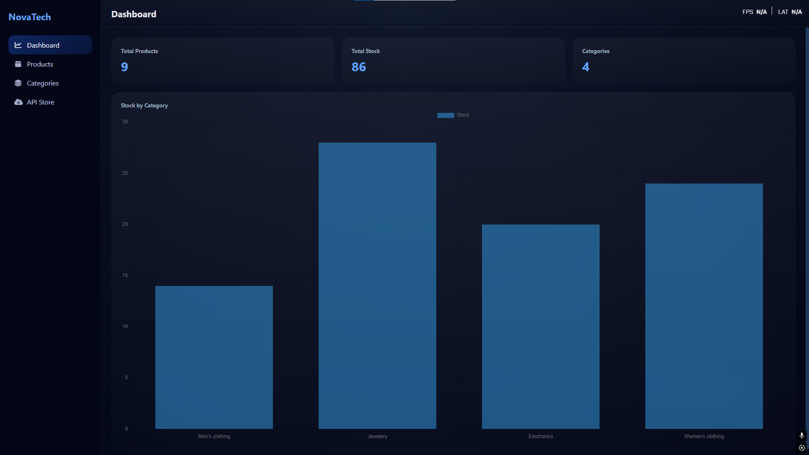
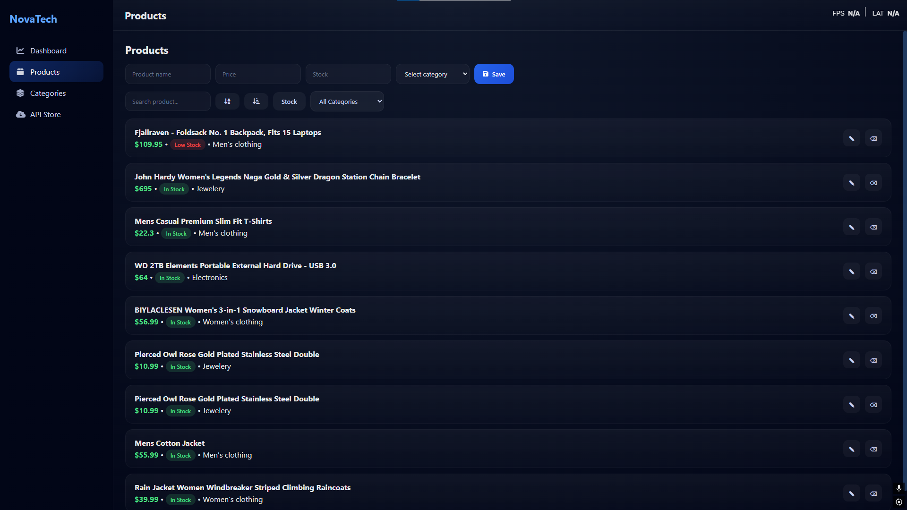

# NovaTech Dashboard

NovaTech is a web dashboard application for managing products in a technology store.
It allows users to manage products, track stock, organize categories, and visualize inventory statistics.

## Live Demo

🚀 **Try the application here:** 
[Open NovaTech Dashboard](https://youssefislamzaitouni.github.io/novatech-dashboard/)

## Demo

A quick preview of the NovaTech dashboard in action.


## Features

* Product CRUD (Create, Read, Update, Delete)
* Category management
* Stock tracking
* Dashboard statistics
* Data visualization with charts
* FakeStore API product import
* LocalStorage data persistence
* Product search, filter, and sorting

## Technologies Used

* HTML
* CSS
* JavaScript
* Chart.js
* FakeStore API

## Project Structure

```
css/        → stylesheets
js/         → JavaScript logic
images/     → screenshots and assets
index.html  → main application entry
README.md   → project documentation
demo.gif    → application preview animation
```

## Project Description

NovaTech is a Single Page Application (SPA) developed as a back-office dashboard for managing a technology store inventory.

The application allows administrators to manage products and categories while visualizing important statistics such as total products, total stock, and stock distribution by category through dynamic charts.

Data persistence is handled using LocalStorage, and external products can be imported from the FakeStore API.

## Screenshots

### Dashboard


### Products


## Authors

- Youssef Islam Zaitouni  
- Mohamed Belaidi  
- Adam Sahim  

Developed as part of a university web development project.

## License

This project is for educational purposes.
